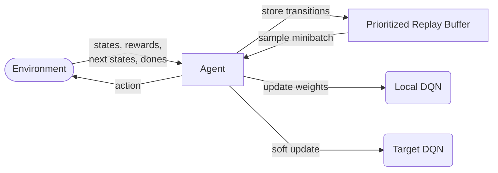

# DQN with Prioritized Experience Replay



This project implements a **Deep Q-Network (DQN)** with **Prioritized Experience Replay** (PER) in **PyTorch**. It uses:

- **Proportional Prioritization** (based on TD error) for the replay buffer.  
- **n-step returns** to capture longer-term rewards.  
- A **fully-connected** (MLP) DQN architecture.  
- **Soft target network updates**.  
- **Importance-sampling weights** for stabilizing training.  

## Table of Contents

1. [Features](#features)  
2. [Installation](#installation)  
3. [Usage](#usage)  
4. [Key Components](#key-components)  
5. [Hyperparameters](#hyperparameters)  

---

## Features

1. **Prioritized Replay Buffer**  
   - Stores transitions in a circular buffer with priorities.  
   - Samples minibatches according to their relative priorities ($p^a$).  
   - Uses **importance-sampling** weights ($\beta$ annealed over time) to correct bias.

2. **n-step Returns**  
   - Accumulates up to *n* consecutive transitions in a small buffer to compute multi-step returns.

3. **DQN**  
   - A multi-layer perceptron with configurable hidden layers.  
   - Uses **Kaiming Normal** weight initialization for better training stability.  

4. **Agent**  
   - Manages the local (online) and target DQN networks.  
   - Handles epsilon-greedy action selection.  
   - Updates Q-values via gradient descent, clipping gradients to avoid exploding values.

---

## Installation

1. **Clone** the repository:
   ```bash
   git clone https://github.com/DanielDiGiovanni-py/reinforcementAgent.git
   cd reinforcementAgent
   ```

2. **Install dependencies** (e.g. in a virtual environment):
   ```bash
   pip install torch numpy matplotlib
   ```
   - You may also need `scipy`, `gym`, or other packages depending on your environment.

3. **Check** Python and PyTorch versions. Recommended:
   - **Python 3.7+**  
   - **PyTorch 1.7+**

---

## Usage

Below is a high-level example of how you might integrate the **Agent** into a training loop:

```python
from agent import Agent 

# Suppose your environment or config provides env_specs
env_specs = {
    'scent_space': np.zeros(10),     # Example: shape (10,)
    'feature_space': np.zeros(5),    # Example: shape (5,)
    'action_space': SomeGymSpace(4)  # Example: 4 discrete actions
}

agent = Agent(env_specs)

# Example training loop
num_episodes = 1000
for ep in range(num_episodes):
    state = env.reset()
    done = False
    t = 0
    while not done:
        action = agent.act(state)
        next_state, reward, done, info = env.step(action)

        # Update the replay buffer & possibly learn
        agent.update(state, action, reward, next_state, done, t)

        state = next_state
        t += 1

# Save weights
agent.save("checkpoint.pth")
```

### Key Points

- The **`Agent.update(...)`** method adds a new transition to the **`PrioritizedReplay`** buffer and periodically triggers `Agent.learn(...)`.  
- The agent uses **epsilon-greedy** behavior in `Agent.act(...)`, with epsilon decaying slightly on each call.  
- You can **load** saved weights with `agent.load_weights(...)`.

---

## Key Components

1. **`PrioritizedReplay`**  
   - Stores experiences $(state, action, reward, next\_state, done)$.  
   - Uses **alpha** $(a\)$ to control how strongly priorities affect sampling.  
   - Uses **beta** ($\beta$), annealed over `b_frames`, for importance sampling correction.  
   - Computes **n-step returns** from a short queue of transitions (`n_step_buffer`).

2. **`DQN`** (inherits from `torch.nn.Module`)  
   - Input layer: size = `state_space`  
   - Several fully connected hidden layers with ReLU activations.  
   - Output layer: size = `action_space` (Q-values for each action).  
   - **Kaiming Normal** initialization to improve training stability with ReLU.

3. **`Agent`**  
   - Holds local (online) network: **`qnetwork_local`**  
   - Holds target network: **`qnetwork_target`**  
   - Uses **SGD** optimizer with momentum for training.  
   - **Soft updates**: ($\theta_{target} \leftarrow \tau \theta_{local} + (1-\tau)\theta_{target}$).  
   - **Epsilon-greedy** policy for action selection, decays epsilon each step.

---

## Hyperparameters

| Parameter           | Value     | Description                                         |
|---------------------|-----------|-----------------------------------------------------|
| `BUFFER_SIZE`       | 1e4       | Maximum size of the replay buffer                  |
| `BATCH_SIZE`        | 8         | Batch size (multiplied by `worker` factor)         |
| `LR` (learning rate)| 0.00025   | Optimizer learning rate                            |
| `tau`               | 1e-3      | Soft update factor                                 |
| `n_step`            | 10        | Number of steps for multi-step returns            |
| `a`                 | 0.6       | PER exponent for priorities (0 = uniform)         |
| `b_start`           | 0.4       | Initial beta for importance-sampling               |
| `b_frames`          | 1e5       | Frames over which beta is annealed to 1           |
| `g`                 | 0.99      | Discount factor                                    |
| `eps`               | 0.05      | Epsilon for epsilon-greedy                         |

Tune these based on your environment and performance requirements.

---

If you have any questions or run into issues, feel free to open an issue or pull request.
